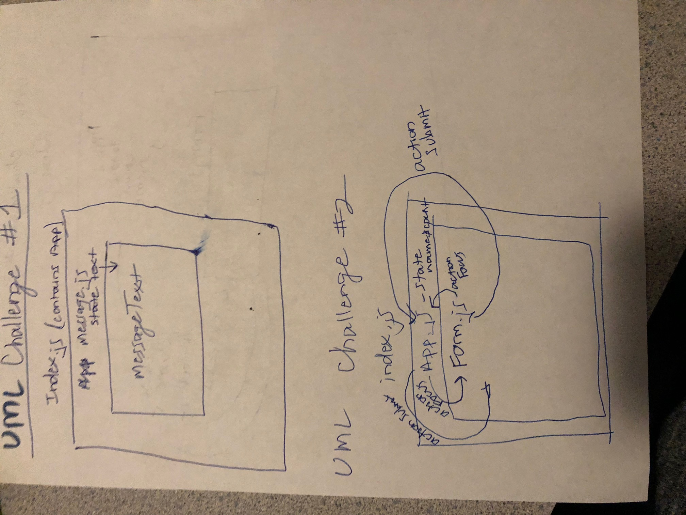
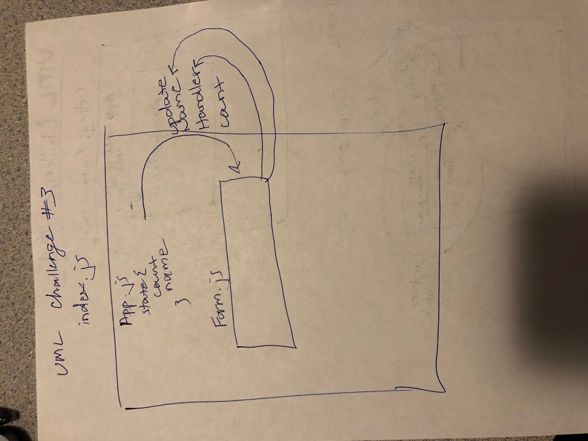

# 28-lab-state-and-props

## Author: Lena Eivy

## Summary: This is a challenge designed to give practice passing state and props between child and parent components in a React App.

Challenge Instructions (Part 1)

## Links for Challenge 1 Part 1:
[codesandbox](https://codesandbox.io/s/mo6z2mv0my)
[codesandbox](https://mo6z2mv0my.codesandbox.io/)

Complete all tasks in this same index.js file
Complete the challenge below and submit the URL to your fork
Create a new component called “Message”
Render the Message component
In this componenet, create a state property named “text”
Set it’s value to “Hello World”
The Message component should render a “div” displaying the contents of the text property from this component’s state
Challenge Instructions (Part 2)

## Links for Challenge 1 Part 2:
[codesandbox](https://codesandbox.io/s/x9qm3p04m4)
[codesandbox](https://x9qm3p04m4.codesandbox.io/)

Fork your completed sandbox
Refactor your work using new modules for each component
Be prepared to discuss/defend file & directory structures chosen
Stretch Goals / Further Practice

Send multiple properties to the message component
Create a 3rd component and have the message property render that one, with some props (maybe even the ones that it received)
Create a 4th component and send props there as well

Assignment 2 - Internal State Practice

## Links for Challenge 2 Part 1;
[codesandbox](https://codesandbox.io/s/q8x65op29q)
[codesandbox](https://q8x65op29q.codesandbox.io/?)

Fork the Internal State Practice Sandbox

Challenge Instructions (Part 1)

Leave these instructions in place
Fork this sandbox
Complete all tasks in this same index.js file
Complete the challenge below and submit the URL to your fork
Add a constructor and declare a state object
“state” should have “count” and “name” properties
Add a form with a single field
As the user types in the field, change the “name” property in state and update the display
When the user “submits” the form, increase the counter by 1 and update the display
The output section below should update as state changes
Challenge Instructions (Part 2)

## Links for Challenge 2 Part 2:
[codesandbox](https://codesandbox.io/s/ol8l8ypknz)
[codesandbox](https://ol8l8ypknz.codesandbox.io/?)

Fork your completed sandbox
Refactor your work using new modules for each component
Be prepared to discuss/defend file & directory structures chosen
Stretch Goals / Further Practice

Instead of updating the count on submit, create a link that updates the count on demand
Use multiple fields in your form to update multiple state properties
Make evaluations on the state of your state to dynamically render things. For example, if the name is empty, show an error or if there are 2 names given (first and last), reverse and comma separate them.
Assignment 3 - External State Practice
Fork the External State Practice Sandbox

Challenge Instructions (Part 1)

## Links for Challenge 3 Part 1:
[codesandbox](https://codesandbox.io/s/w29wx37zyl)
[codesandbox](https://w29wx37zyl.codesandbox.io/?)

Leave these instructions in place
Fork this sandbox
Complete the challenge below and submit the URL to your fork
Add a constructor and declare a state object
“state” should have “count” and “name” properties
Create a “handler” method that will take name as a parameter and updates the state with the given name and an increased count
Import a new “Form” component (created in the steps below later)
Render the “Form” component with a reference to the update method created above, via property
Create a new “Form” Component
Add a form element with a single field
As the user types in the field, change the “name” property in state
When the user “submits” the form invoke handler method in the parent component, sending the updated name
The output section below should update as state changes
Challenge Instructions (Part 2)

## Links for Challenge 3 Part 2:
[codesandbox](https://codesandbox.io/s/n71r86nv5l)
[codesandbox](https://n71r86nv5l.codesandbox.io/)

Fork your completed sandbox
Refactor your work using new modules for each component
Be prepared to discuss/defend file & directory structures chosen
Stretch Goals / Further Practice

Instead of updating the count on submit, create a link that updates the count on demand
Use multiple fields in your form to update multiple state properties
Make evaluations on the state of your state to dynamically render things. For example, if the name is empty, show an error or if there are 2 names given (first and last), reverse and comma separate them.

## UML

